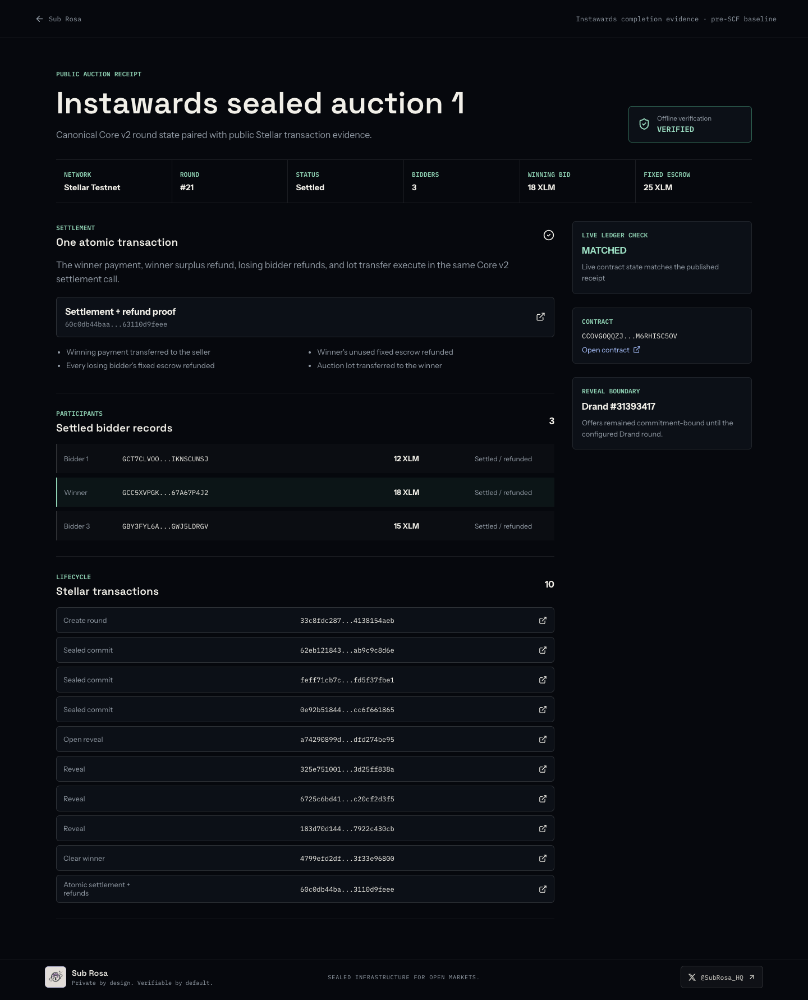

# Instawards Completion Evidence

**Status:** Complete on Stellar testnet, 2026-08-17  
**Scope:** Sealed-auction integration kit (public receipt, template, and three live rounds)  
**SCF boundary:** This is completed Instawards work and a **pre-SCF baseline**. Rounds 21-23 do not count toward any SCF post-award round target or future SCF-funded deliverable.

[Download the completed SOW PDF](./INSTAWARDS_SOW_COMPLETED.pdf) | [Read this evidence pack online](https://github.com/karagozemin/Sub-Rosa/blob/main/docs/INSTAWARDS_COMPLETION.md)

## Reviewer links

All three rounds use Core v2 `Auction`, native testnet XLM escrow, three distinct
bidders, and the same public testnet contract:

[View the contract on Stellar Expert](https://stellar.expert/explorer/testnet/contract/CCOVGOQQZJKZ2R55GRWBLTJTGBAMSHXZVN3ICPG3WRVMLMM6RHISC5OV)

| Round | Public receipt | Raw evidence | Create transaction | Atomic settlement + refunds |
| --- | --- | --- | --- | --- |
| 21 | [Open receipt](https://www.sub-rosa.online/#/receipt/instawards-auction-1) | [JSON](https://www.sub-rosa.online/instawards/receipts/instawards-auction-1.json) | [33c8...4aeb](https://stellar.expert/explorer/testnet/tx/33c8fdc287adf79757e5d1b53c18cb1710373121d0ceaed36bb3b44138154aeb) | [60c0...feee](https://stellar.expert/explorer/testnet/tx/60c0db44baad1f367551b48157f5652242553392eab476df8b5c463110d9feee) |
| 22 | [Open receipt](https://www.sub-rosa.online/#/receipt/instawards-auction-2) | [JSON](https://www.sub-rosa.online/instawards/receipts/instawards-auction-2.json) | [47c6...90b4](https://stellar.expert/explorer/testnet/tx/47c6f5b49dc2f3b69b46cd7fcc000da4d2f801c4fb79a58ac4ea2e6b3e8490b4) | [bbc7...972a](https://stellar.expert/explorer/testnet/tx/bbc799913584968b19d572849fd747bd0b2168cec948b832611c9696337d972a) |
| 23 | [Open receipt](https://www.sub-rosa.online/#/receipt/instawards-auction-3) | [JSON](https://www.sub-rosa.online/instawards/receipts/instawards-auction-3.json) | [2eb7...5301](https://stellar.expert/explorer/testnet/tx/2eb778dc7c6d471bc06fc1034b55494f5026b2949f2da5835144cda81eeb5301) | [161f...4c32](https://stellar.expert/explorer/testnet/tx/161f8c24d076d75ef82b3d5372742a680431f4770e02359186c069e872044c32) |

The settlement and refund columns intentionally contain one transaction per
round. Core v2 performs the seller payment, winner surplus refund, every losing
bidder refund, and lot transfer atomically in that single `settle_v2` call.

## Deliverables

### D1: Public auction receipt

The `PublishedAuctionEvidence` SDK module pairs the canonical Core v2 receipt
with all lifecycle transaction hashes. Its verifier checks the canonical
receipt, Auction/Settled status, bidder minimum, transaction evidence, and the
atomic settlement/refund hash. The public page additionally reads the current
round from Stellar RPC and compares status, mode, bidder count, winner, and
winning amount with the published record.

The Core v2 contract test `v2_auction_binds_full_payload_and_conserves_funds`
proves exact seller payment, winner surplus, loser refund, drained contract
balance, and lot transfer. The full contract suite contains 100 passing tests.

### D2: Integration template and quickstart

The copy-paste runner and setup guide are in
[`services/auction-template`](../services/auction-template/README.md). The same
runner created rounds 21-23 using only the public `@sub-rosa/sdk` surface. It
creates rounds, submits three time-locked bids, fetches the real Drand beacon,
reveals, clears, settles, and exports verified evidence without persisting any
secret key.

### D3: Live testnet demo and receipts

Rounds 21-23 each have three bidders and ten public lifecycle transactions:
one create, three commits, one open-reveal, three reveals, one clear, and one
atomic settle/refund. The live links above expose the result and every Stellar
Expert transaction link from one page.



## Lifecycle in plain language

1. The seller escrows the lot and fixes identical 25 XLM bidder escrow.
2. Three allowlisted testnet accounts submit encrypted, commitment-bound bids.
3. No bid amount is readable before Drand round 31393417.
4. After the beacon arrives, the envelopes reveal and the contract records the
   valid bid amounts.
5. After the reveal window, anyone can clear the highest valid bid.
6. One atomic call pays the seller, refunds unused and losing escrow, and sends
   the lot to the winner.
7. The SDK exports a canonical receipt and verifies it offline; the public page
   separately reconciles the receipt with live contract state.

## Reproduce and verify

```bash
pnpm install
pnpm packages:build
pnpm --filter @sub-rosa/auction-template test
pnpm contract:test
pnpm web:build
```

To run a new testnet auction, follow the
[template quickstart](../services/auction-template/README.md). Generated public
records use `sub-rosa/published-auction-evidence/v1` and are indexed by
[`manifest.json`](../apps/web/public/instawards/manifest.json).

## Known limits

- Testnet only; no real-value or mainnet claim is made.
- The auction lot is a test asset; bidder escrow is native testnet XLM.
- The runner is demo-grade, not highly available keeper infrastructure.
- No third-party security audit is claimed.
- No production database, multi-tenant dashboard, anti-sybil layer, custom
  wallet, governance, or fee market is included.
- The offline verifier proves receipt consistency. High-value consumers should
  also reconcile the receipt against live ledger state, as the public page does.
